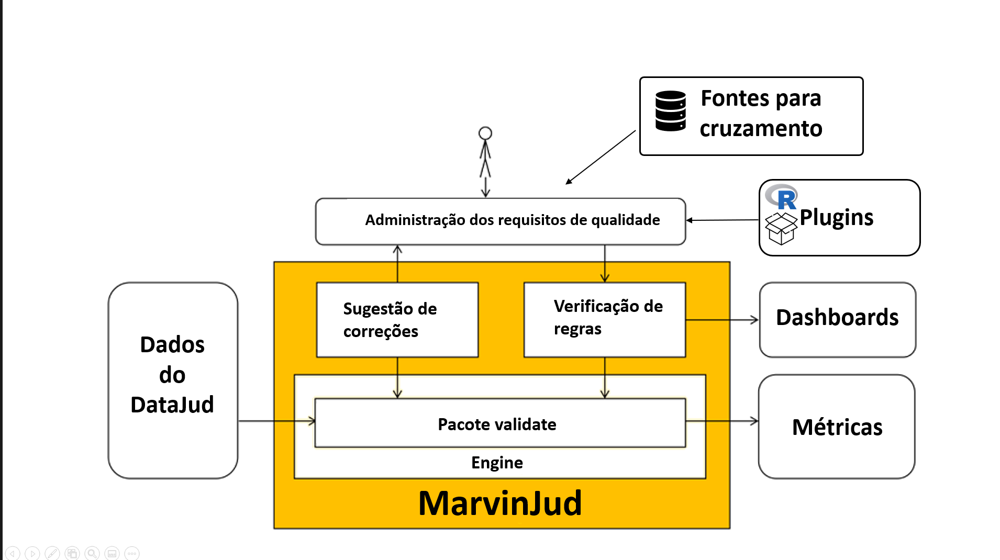
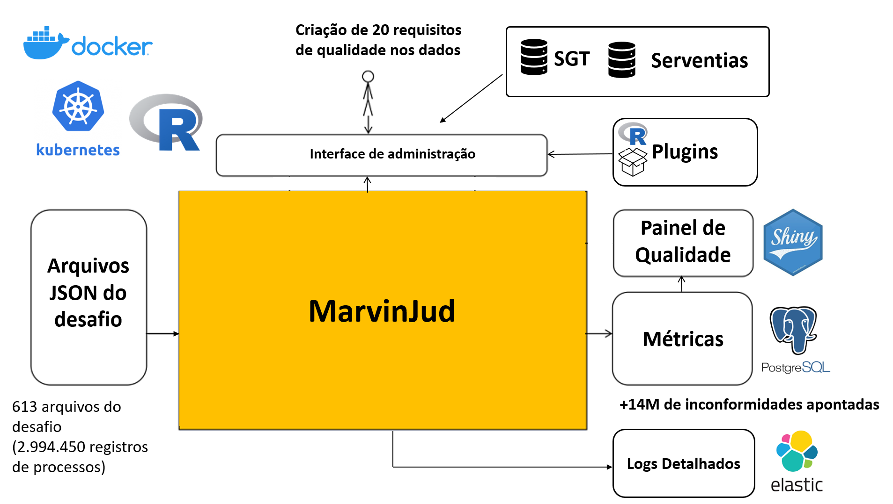

# cnj-inova-desafio2-time20

## Repositório do time 20  no Hackathon CNJ - Desafio Inconsistência de dados nos sistemas dos tribunais (Desafio 2)

## Proposta

O CNJ instituiu a Base Nacional de Dados do Poder Judiciário – DataJud como fonte primária de dados do Sistema de Estatística do Poder Judiciário – SIESP. Os dados do DataJud são usados para estudos e diagnósticos, permitindo-se o aprimoramento da gestão e prestação jurisdicional pelos tribunais.

Propomos uma solução tecnológica flexível que permite ao CNJ definir os requisitos de qualidade  e os tratamentos desejados nos dados enviados pelos tribunais. A solução permite ao CNJ verificar a integridade, exatidão, consistência e validade dos dados. 

A solução desenvolvida traz uma resposta ao desafio proposto, já que garante a conformidade dos dados com os requisitos de qualidade, pois diferentes tipos de regras de validação podem ser executados dependendo das restrições ou objetivos da avaliação.

## Visão Geral da Solução

O MarvinJud é uma solução para identificação e tratamento das inconsistências nos dados do DataJud, que estende as funcionalidades e infraestrutura oferecidas pelo [pacote R validate](https://cran.r-project.org/web/packages/validate/index.html).

O pacote **validate** permite a definição sistemática dos requisitos de qualidade e pode ser utilizada por algoritmos de correção de dados, que são parametrizados pelas regras de validação. Detalhes da implementação do pacote **validate** estão disponíveis **[nesse artigo] (https://cran.r-project.org/web/packages/validate/vignettes/JSS_3483.pdf)** publicado  no **[Journal of Systems and Software] (https://arxiv.org/abs/1912.09759)**. O **validate** é um projeto de código aberto disponível no [Github](https://github.com/data-cleaning/validate).
 
Também desenvolvemos uma arquitetura de **[plugins] (/produto/engine/plugins)**  que permite utilizar **[pacotes R] (https://cran.r-project.org/web/packages/available_packages_by_name.html)** em funções de validação para os requisitos de qualidade dos dados. Foram construídos plugins para algumas funções dos seguintes pacotes:

**[Pacote abjutils](https://cran.r-project.org/package=abjutils)** :: Pacote da   **[Associação Brasileira de Jurimetria] (https://abj.org.br/)** que implementa ferramentas de uso geral utilizadas pela ABJ, como funções de amostragem e manipulação básica do número de identificação de ações judiciais brasileiras. Também implementa algumas funções para limpeza de textos.

**[Pacote caret](https://cran.r-project.org/web/packages/caret/index.html)** :: Pacote para trabalhar com modelos de regressão e classificação.

**[Pacote tfdleploy](https://cran.r-project.org/web/packages/tfdeploy/index.html)** :: Pacote para implantação de modelos de aprendizado de máquina desenvolvidos com o **[TensorFlow] (https://www.tensorflow.org/?hl=pt-br)**

Na figura abaixo apresentamos um desenho da solução  construída:

### Dados do Datajud
O MarvinJud é agnóstico em relação a origem dos dados. A interface do MarvinJud com o DataJud utiliza as estruturas de Data Frames do R. Os dados podem ser carregados de qualquer fonte que tenha algum pacote de conectividade com o R disponível, eles podem vir de arquivos JSON, arquivos XML, bases de dados relacionais ou NoSQL.

### [admin](/produto/admin/) - Interface de administração dos requisitos de qualidade
Interface web construída em [Shiny](https://shiny.rstudio.com/) para administração dos requisitos de qualidade dos dados.

### [engine](/produto/engine/) - Mecanismo de processamento dos dados do DataJud
Componente de "orquestração" entre os requisitos de qualidade definidos, o processamento das regras pelo **validate** e a instrumentação dos resultados. Também é responsável por retornar os logs detalhados de cada validaçao, o nome dos atributos, registros e  valores que geraram cada  inconformidade detectada no processamento.

### Fontes para cruzamento
São fontes de dados externas ao DataJud que podem ser utilizadas para o cruzamento dos registros. Estão disponíveis para criação de requisitos de qualidade todas as tabelas do banco de dados **[sgt_consulta] (https://www.cnj.jus.br/sgt/versoes.php)**, além das informações de serventias do arquivo **mpm_serventias.csv**.

## Caso de Uso: Processamento dos arquivos do desafio

Os 631 arquivos JSON do desafio foram tratados pela [rotina de processamento](caso_de_uso/processa-json-desafio).
Os 2.994.450 registros de processos foram avaliados para atenderem a um conjunto de [20 requisitos de qualidade](link_regras). 

Diversos tipos de regras foram criadas:

1. Comparação de valores entre campos;
2. Validações utilizando as tabelas do SGT e de serventias ;
3. Digito verificador do número CNJ através do plugin para o pacote **abjutils**.
 
As regras definidas demonstram a flexibilidade para a criação de diversos tipos de requisitos de qualidade, além disso, explorarmos algumas possibilidades de análises com os dados retornados pelo MarvinJud. 

No caso de uso, todos os eventos gerados pelo MarvinJud foram enviadas para um indíce no Elastic e também foi construída uma "base de métricas" de qualidade por processo recebido. Essa base de métricas foi gravada no banco de dados PostgreSQL com o nome de **bd_marvinjud.registro_validacao**. Em cima desses dados, foi gerado o [Dashboard Painel de Qualidade](/caso_de_uso/painel-qualidade).

### [Painel de Qualidade](/caso_de_uso/painel-qualidade)
Dashboard construído utilizando  [Shiny](https://shiny.rstudio.com/) para visualização das métricas de processamento dos arquivos do desafio. Para uma melhor performance, as consultas desse painel são geradas através de consultas as views materializadas no PostgreSQL **bd_marvinjud.vmw_validacao_ano** e **bd_marvinjud.vwm_validacao_orgao**. Essas views são atualizadas automaticamente durante [rotina de processamento](caso_de_uso/processa-json-desafio).

Na figura abaixo apresentamos um desenho da solução  construída:

## Como rodar o projeto

### Nas IDE de desenvolvimentos

Todos artefatos produzidos são acessível pelo ambiente de desenvolvimento Rstudio através do arquivo .Rproj no diretório raiz de cada componente. 

Todas os projetos utilizaram o  [pacote renv](https://rstudio.github.io/renv/articles/renv.html) como mecanismo para gerencias as dependências com outros componentes. Após abrir o projeto no RStudio é necessário digitar o comando: renv::restore() para instalar no ambiente R do projeto todas as dependências necessárias.

## Guia de licenças

### Para rodar o projeto:
Todas as ferramentas e bibliotecas utilizadas para rodar o projeto são softwares de código livre.
Todas as imagens docker foram construidas com bases me imagens oficiais disponíveis no **[dockerhub](https://hub.docker.com/)**.
Todos os pacotes R utilizados na solução estão disponíveis no repositório público **[CRAN] (https://cran.r-project.org/web/packages/available_packages_by_name.html)**:
Detalhes do tipo licenças utlizadas pelos principais componentes da solução estão no arguivo **[Licenças] (licenças/README.md)**:
	
### Para a geração de dados no Painel de Qualidade:

No Painel de Qualidade foi utilizada a [API de geolocalização](https://developers.google.com/maps/documentation/geocoding/overview) do Google Maps para a extração da localização exata das serventias e geração do [arquivo geo_serventias.csv](dados/geo_serventias.csv) devido a pouca precisão dos atributos **LATITUDE** e **LONGITUDE** já presentes na tabela "mpm_serventias".

No [script de georeferenciamento das serventias](/caso_de_uso/painel-qualidade/utilitarios/extrator_geo_serventias/extrator_geo_serventias.R)  a chave da API foi alterada no código fonte para uma valor inválido, para evitar o seu vazamento no repositório público.

Foi possível fazer todas as chamadas de APIs para os 39.100 orgãos julgadores com o nível gratuíto do serviço Google Maps (Até 200 USD mensais).	

Eventuais atualizações incrementais devem gerar um consumo mensal inferior  ao da primeira carga para todas as serventias da base.

Uma alternativa para não utilizar serviços externos para a montagem do painel seria garantir a consistência dos campos **LATITUDE** e **LONGITUDE** já presentes na **mpm_serventias**.